## E-mail: felipekian@yahoo.com.br

# PROJETO E-COMMERCE

Projeto desenvolvido para a disciplina de **Banco de Dados II** - Sistema Poliglota (2 bancos de dados na mesma aplicação)

O sistema desenvolvido conta com duas frentes:

* **LADO ADMINISTRATIVO:**
  No lado administrativo, as pessoas podem:
  * Cadastrar Produtos;
  * Postar Produtos,
  * Listar Produtos Cadastrados,
  * Atualizar Informações Dos Produtos,
  * Área de Chat Para Responder Dúvidas de Clientes,
  * Listagem Dos Pedidos Realizados.
  
* **LADO CLIENTE:**
  No lado da loja, as pessoas podem:
  * Realizar Cadastro na Loja,
  * Adicionar Produtos ao Carrinho de Compras,
  * Comparar Produtos,
  * Ver Detalhes de Produtos,
  
 * **TRANSPORTADORA**
  * Projeto que recebe um **CEP** e devolve um valor do frete (simular sistema distribuido).
  
## OBJETIVOS

O objetivo deste trabalho foi colocar em prática os conceitos de **banco de dados No-SQL** juntamente com **banco de dados SQL** em um **sistema poliglota**.

## RECURSOS UTILIZADOS
  
  * **JAVASCRIPT**
    * NodeJS
    * Express
    * Express-validator
    * Express-generator
    * SocketIO
   
   * **BANCO DE DADOS:** (Sistema Poliglota)
    * MongoDB
    * MySQL
    
# ESPECIFICAÇÕES

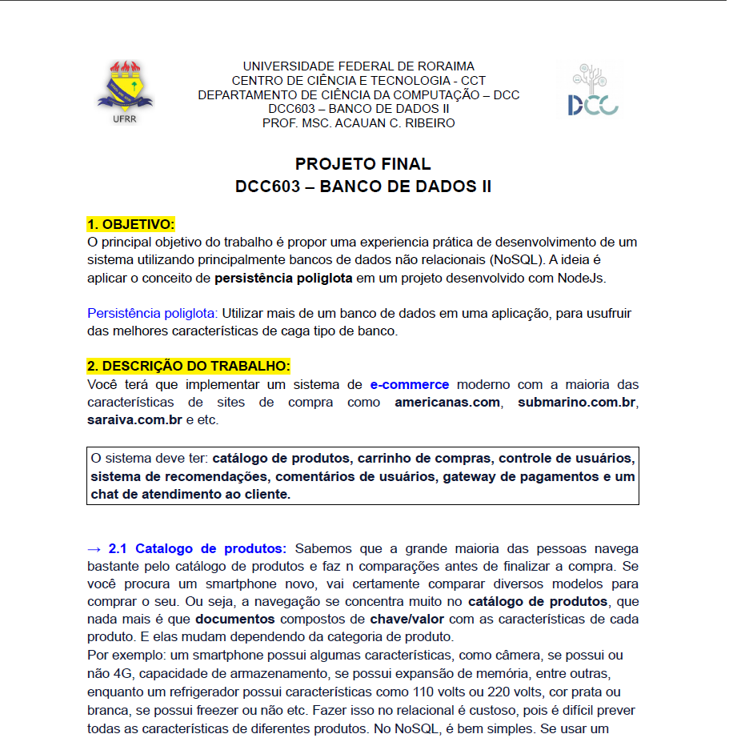
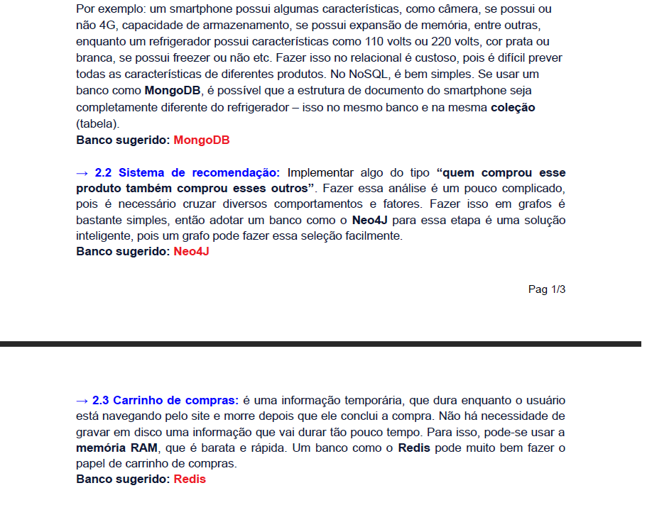
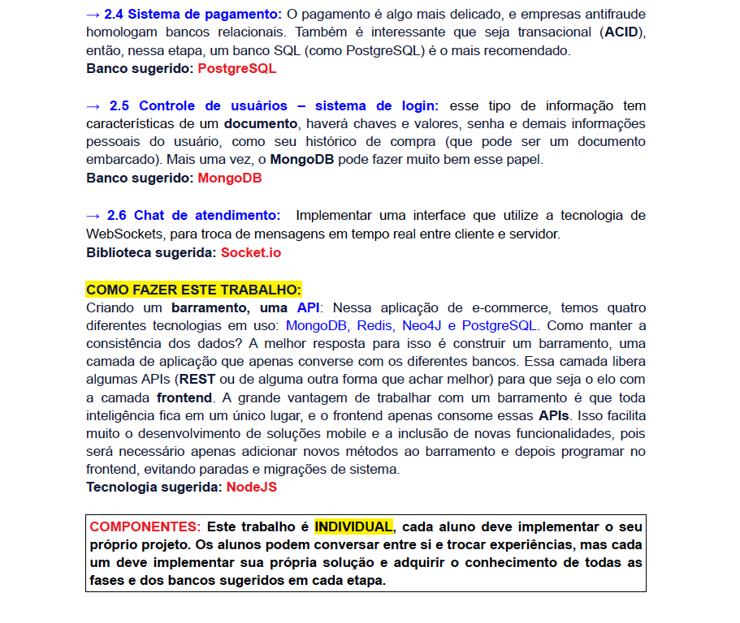

# IMAGENS DO SISTEMA

Seguem as imagens do sistema tanto lado usuário quanto administrativo.

## LOJA LADO CLIENTE

 
Tela **Home** da loja
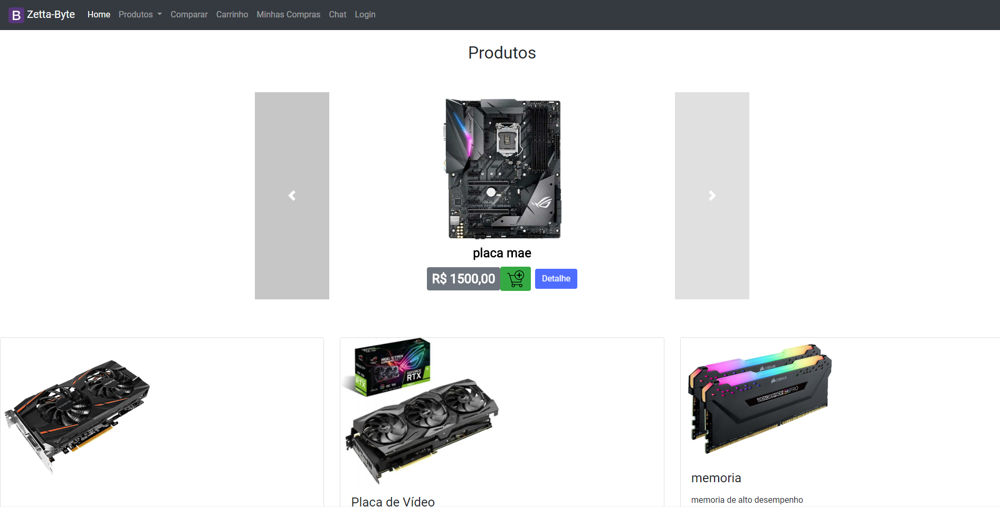

 
Tela **Login Cliente**
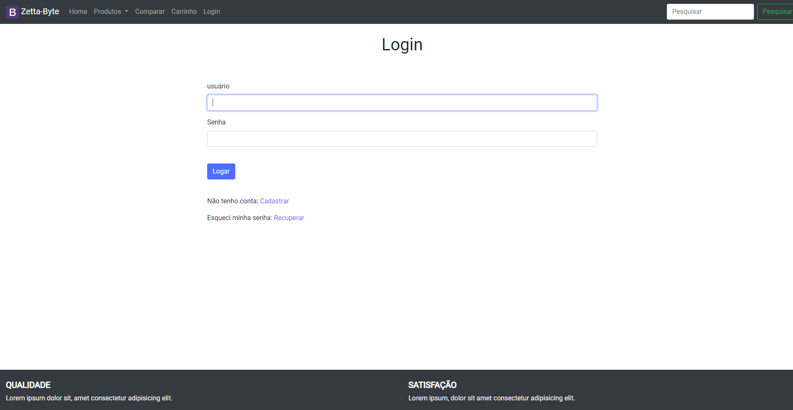

 
Tela **Cadastro Cliente**
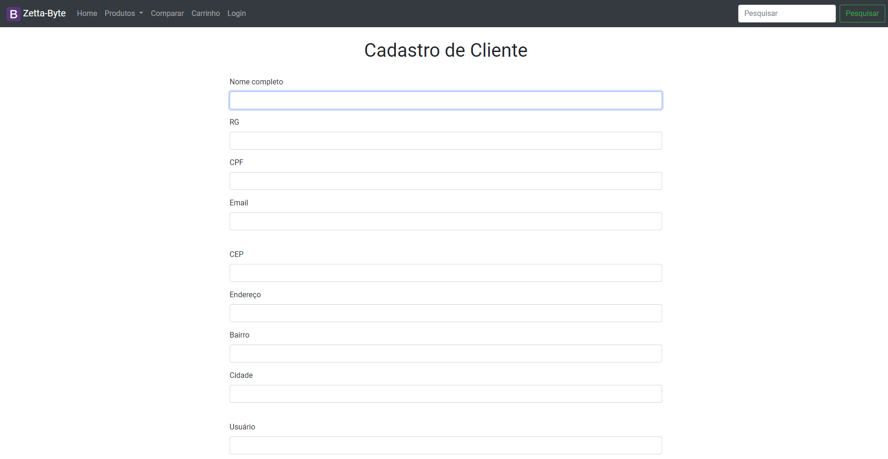

 
Tela **Listagem de Produtos** (ex.: Placa Mãe)
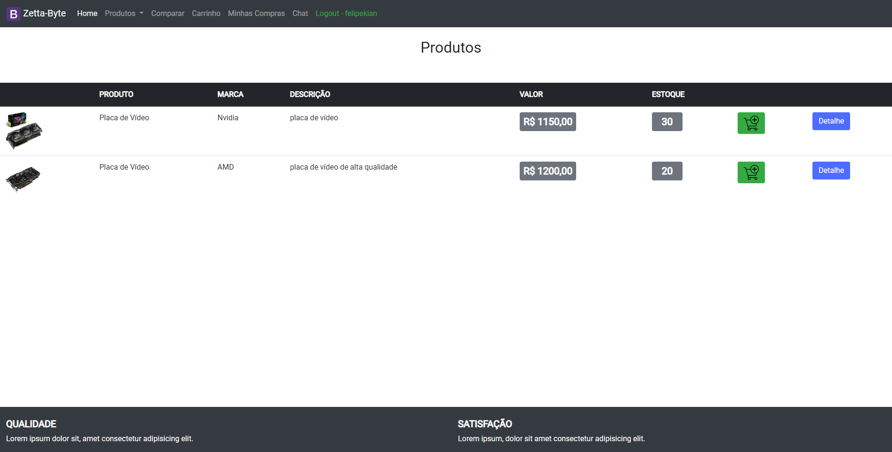

 
Tela **Compare Dois Produtos**
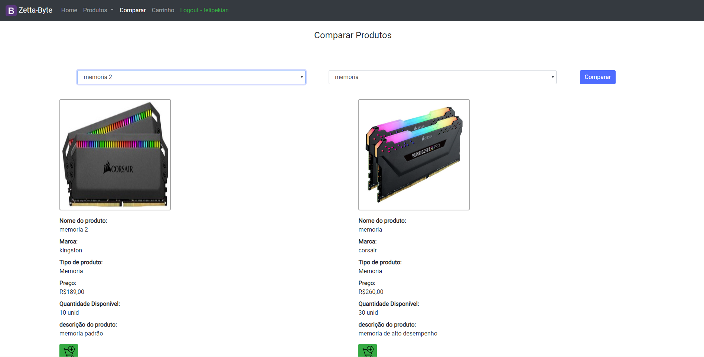

 
Tela **Carrinho De Compras**
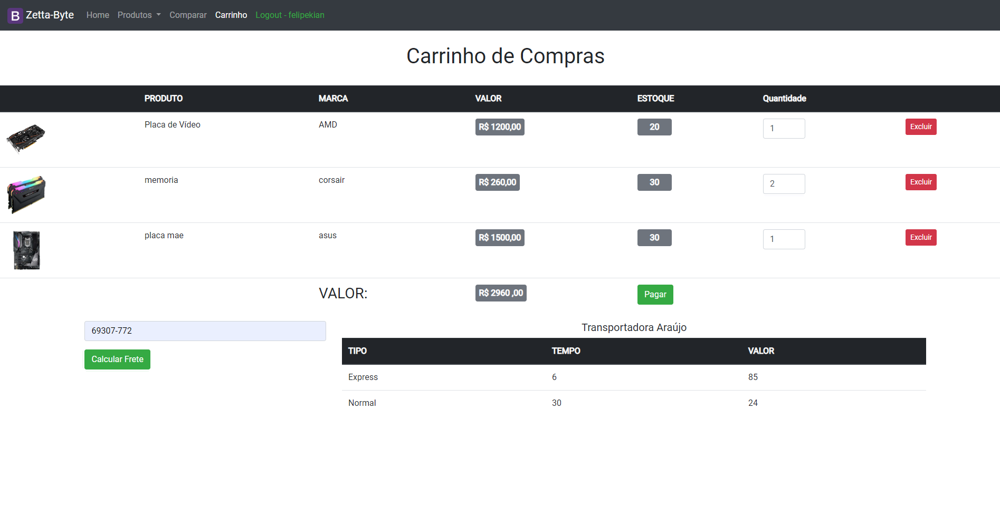

 
Tela **Chat** ( cliente conversa com Admin )
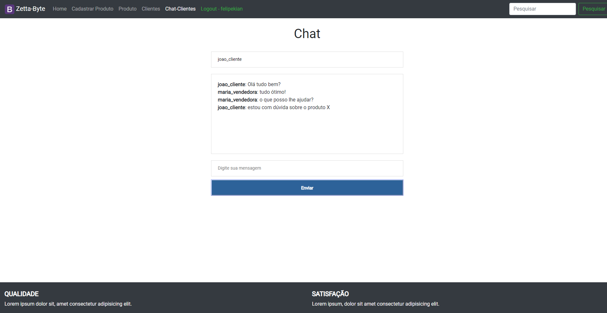

## LOJA LADO ADMINISTRADOR

 
Tela **Cadastro de Novos Produtos**
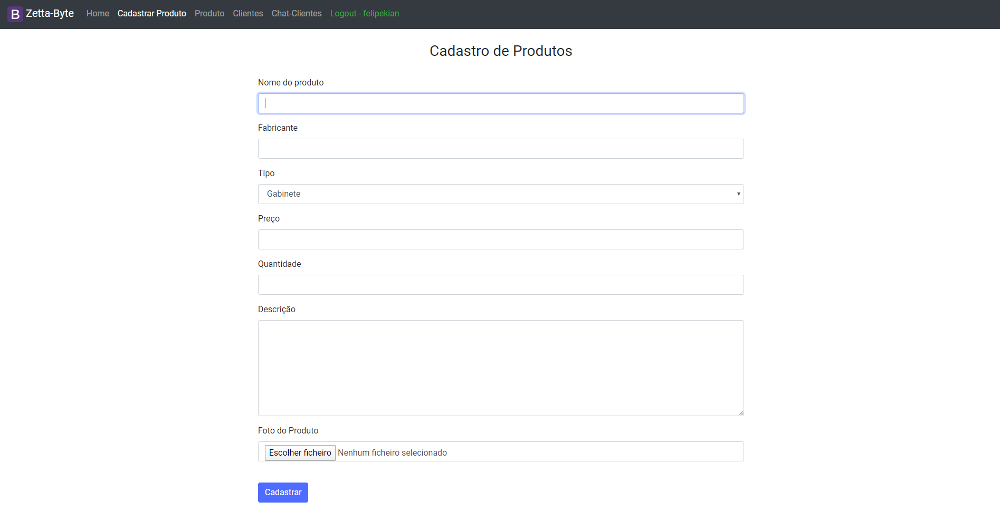

 
Tela **Detalhes do Produto Escolhido**
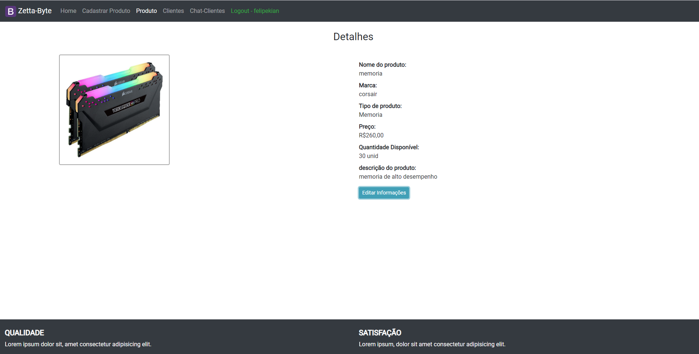

 
Tela **Listagem dos Produtos Cadastrados**
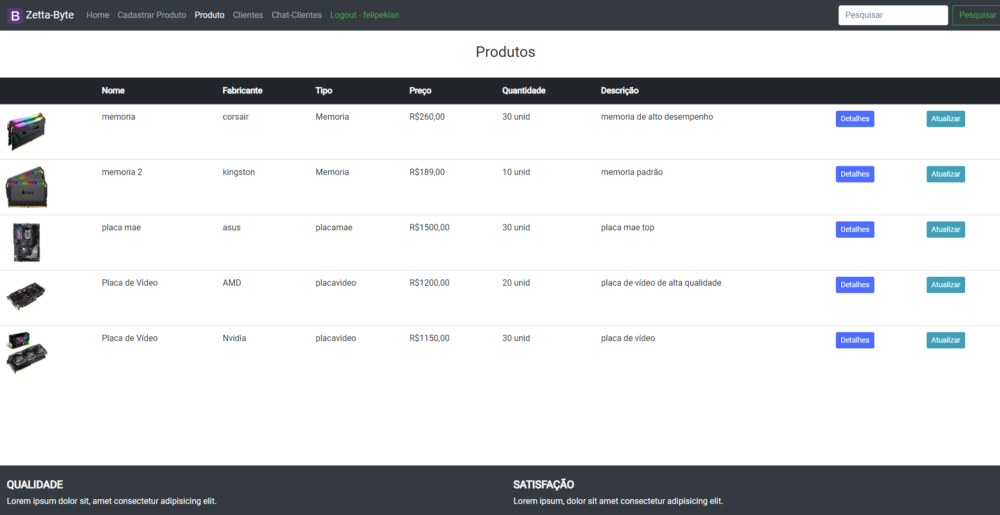

 
Tela **Atualizar Dados do Produto**
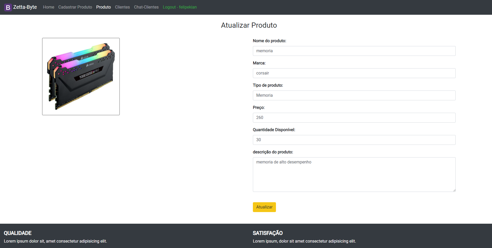

 
Tela **Listagem dos Clientes Cadastrados**
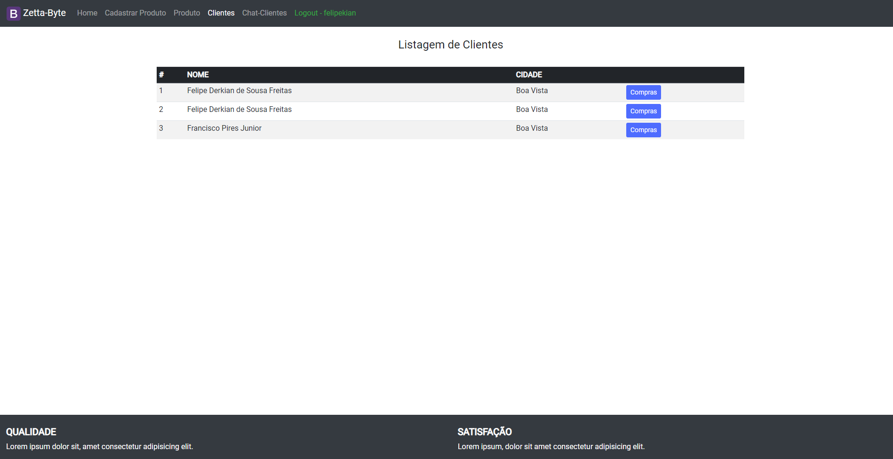

 
Tela **Listagem dos Pedidos**
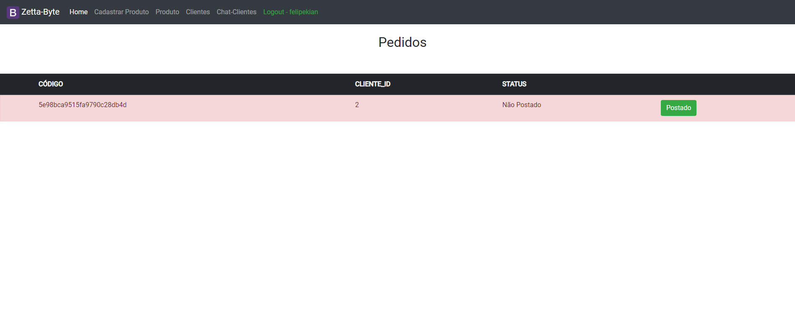

 
Tela **Chat** ( Conversa entre cliente e admin )
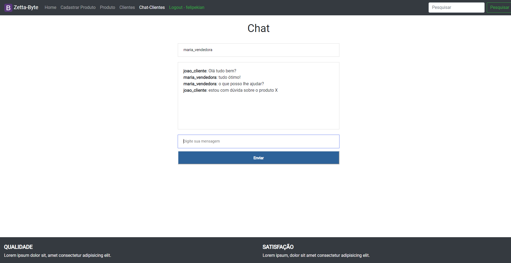

 

# OBRIGADO PELA ATENÇÃO

## E-mail: felipekian@yahoo.com.br
